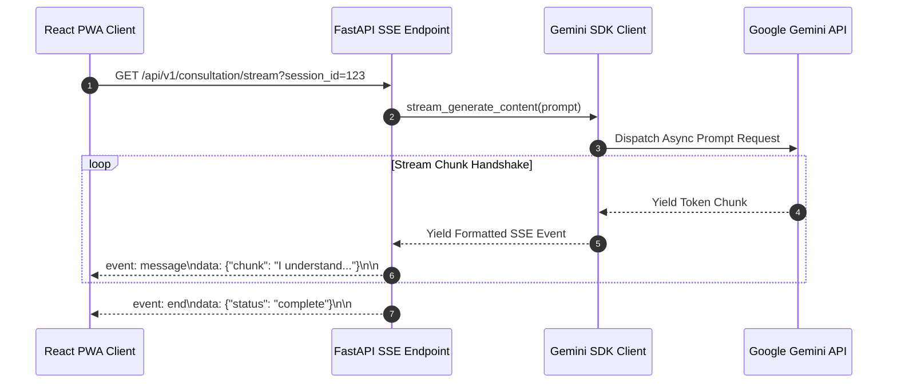

# AI Architecture & Gemini Integration Specification

## 1. Role of AI in the Hybrid System

In the **Health Triage Assistant**, Google Gemini AI acts strictly as an **Empathetic Contextual & Conversational Synthesizer**. It does **NOT** compute clinical severity levels.

```
+----------------------------------------------------------------------------+
|                          INPUT TRANSCRIPT                                  |
| "My 4-year-old child has had a high fever for 2 days and won't drink water" |
+----------------------------------------------------------------------------+
                                      |
                                      v
+----------------------------------------------------------------------------+
|                        CLINICAL RULE ENGINE                                |
| Computes: Severity = ORANGE (Pediatric Dehydration Risk)                   |
+----------------------------------------------------------------------------+
                                      |
                                      v
+----------------------------------------------------------------------------+
|                     GEMINI AI ENRICHMENT ENGINE                             |
| Input: Transcript + Enforced Severity (ORANGE)                             |
| Prompt Guardrails: Must reflect ORANGE urgency, provide fluid advice,      |
| speak in reassuring tone, translate complex terms to simple English/Twi.   |
+----------------------------------------------------------------------------+
                                      |
                                      v
+----------------------------------------------------------------------------+
|                         FINAL STREAMED OUTPUT                              |
| "I hear how worried you are about your child. Because your little one has  |
| a fever and isn't drinking, they need to be seen by a nurse or doctor     |
| today (ORANGE - Very Urgent). In the meantime, try giving small sips..."   |
+----------------------------------------------------------------------------+
```

---

## 2. Gemini API Prompt Design & System Instructions

### System Instruction Template (`app/infrastructure/ai/prompts.py`)

```text
SYSTEM INSTRUCTION: You are an empathetic, culturally sensitive medical triage assistant.
Your goal is to explain a pre-computed clinical triage result to a user in clear, comforting language.

CRITICAL CONSTRAINTS:
1. SEVERITY LEVEL LOCK: The pre-calculated triage urgency level is [{URGENCY_LEVEL}]. You MUST NOT downgrade, upgrade, or contradict this severity level under any circumstances.
2. NON-DIAGNOSTIC DISCLAIMER: Never offer a definitive medical diagnosis. Use phrases like "These symptoms can occur with..." or "To be safe, a healthcare provider should examine..."
3. EMERGENCIES: If URGENCY_LEVEL is RED, start immediately with "EMERGENCY: Seek immediate medical help right now."
4. LANGUAGE & TONE: Use simple language (Grade 6 reading level). Avoid complex jargon. If the requested language is Twi, use culturally appropriate, respectful Twi phrases.
5. CONCISENESS: Limit your response to 3-4 bullet points maximum.
```

---

## 3. Token Streaming & Backend Client Implementation

The backend integrates the Gemini API using the `google-genai` SDK with **async token streaming** via FastAPI Server-Sent Events (SSE).



---

## 4. Safety Guardrails & Validation Layer

Before any AI response chunk is returned to the client, it passes through the **Response Validation Layer**:

1. **Severity Consistency Check**: Regex validation ensuring the text does not contain conflicting urgency terms (e.g., advising "You can relax at home" when severity is `ORANGE` or `RED`).
2. **Harm Prevention Filter**: Built-in Gemini safety settings configured to `BLOCK_MEDIUM_AND_ABOVE` for Harassment, Hate Speech, Sexually Explicit, and Dangerous Content.
3. **Fallback Override**: If the AI response fails validation or encounters an API error, the backend immediately drops the AI stream and returns the static pre-validated clinical triage template.
