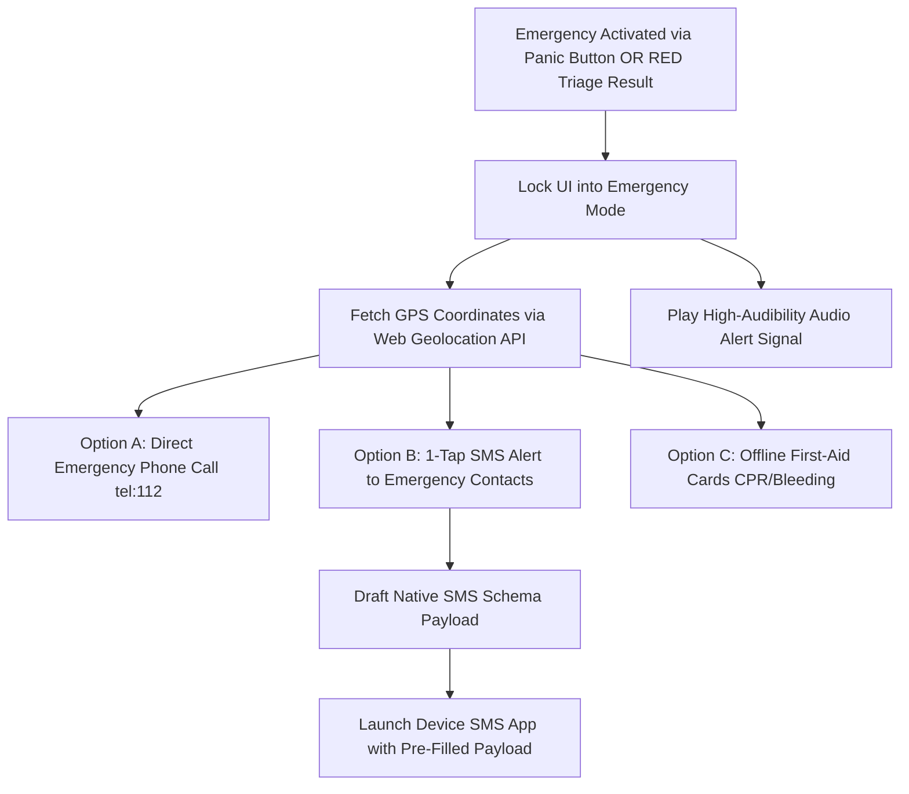

# Emergency System & Dispatch Architecture

## 1. Overview

The **Emergency System** is the highest priority sub-component of the Health Triage Assistant. It guarantees zero-friction access to life-saving tools, contact dispatch, location telemetry, and first-aid instructions regardless of network availability.

---

## 2. Emergency Trigger Workflow



---

## 3. Emergency Payload Formats

### 3.1 Offline SMS Emergency Payload Schema
When the user taps "Send SMS Alert", the system construct a URI using the standard `sms:` protocol scheme:

```
sms:+233240000000;+233500000000?body=EMERGENCY%20HEALTH%20ALERT!%20Name:%20Kwame%20Mensah.%20Symptom:%20Chest%20Pain.%20GPS:%20https://maps.google.com/?q=5.6037,-0.1870%20(Accuracy:%2010m).%20Sent%20via%20HealthTriageApp
```

### 3.2 Server API Emergency Dispatch Payload (JSON)
If online, the system simultaneously dispatches a HTTP POST request to the backend:

```json
{
  "triageSessionId": "9b1deb4d-3b7d-4bad-9bdd-2b0d7b3dcb6d",
  "userId": "a0eebc99-9c0b-4ef8-bb6d-6bb9bd380a11",
  "urgencyLevel": "RED",
  "location": {
    "latitude": 5.6037,
    "longitude": -0.1870,
    "accuracyMeters": 10.5
  },
  "primarySymptom": "Acute Chest Pain",
  "emergencyContacts": [
    { "name": "Kofi Mensah", "phone": "+233240000000", "relationship": "Brother" }
  ],
  "triggeredAt": "2026-07-26T12:00:00Z"
}
```

---

## 4. Offline First-Aid Vector Library

The system bundles vector SVG graphics and step-by-step card manifests pre-cached in the PWA Service Worker for the following acute conditions:

1. **Cardiopulmonary Resuscitation (CPR)**: Adult & Pediatric compressions/breaths cycle (30:2).
2. **Choking (Heimlich Maneuver)**: Abdominal thrusts and back blows.
3. **Severe Hemorrhage / Bleeding**: Direct pressure, elevation, tourniquet protocol.
4. **Burns**: Cool water flushing, clean dressing, shock mitigation.
5. **Unconsciousness / Recovery Position**: Airway management and lateral tilt.

---

## 5. Facility Finder Interface

When online, the Emergency Centre queries spatial postgis endpoints to locate the nearest emergency-capable clinics and hospitals within a 25km radius, rendering distance, contact numbers, and navigation links. When offline, it serves a pre-cached offline directory of major regional hospitals.
