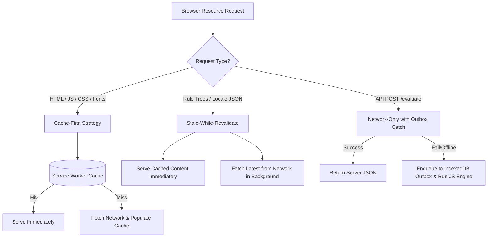

# Frontend Architecture Specification

## 1. Technology Stack & Framework Choices

The frontend of the **Health Triage Assistant** is engineered as a high-performance **Progressive Web Application (PWA)** built with modern web technologies:

- **Core Framework**: React 18+ (Functional Components with Hooks).
- **Build System**: Vite (Sub-second HMR and optimized ESBuild production bundling).
- **Styling Framework**: Vanilla CSS / Tailwind CSS (Custom Design System with high-contrast health palette).
- **State Management**: Zustand (Lightweight global state) + Dexie.js / IndexedDB (Local persistence).
- **Data Fetching / Sync**: TanStack Query (React Query v5) with custom offline queue mutation adapters.
- **PWA Service Worker**: Workbox v7 (Pre-caching and runtime caching strategies).

---

## 2. Component Hierarchy & Atomic Architecture

```mermaid
graph TD
    App[App Container & Layout] --> Navbar[Navigation Bar & Emergency Header]
    App --> Router[React Router Context]
    
    Router --> Home[Home Page / Quick Intake]
    Router --> Triage[Triage Workflow View]
    Router --> Emergency[Emergency Centre View]
    Router --> Profile[Health Profile & History View]
    Router --> Analytics[Analytics Dashboard View]

    Triage --> SymptomIntake[SymptomIntake Component]
    Triage --> DecisionQuestionnaire[DecisionQuestionnaire Component]
    Triage --> TriageCard[TriageCard Component (RED/ORANGE/YELLOW/GREEN)]
    
    Emergency --> PanicButton[PanicButton Component]
    Emergency --> FirstAidCard[FirstAidCard Component]
    Emergency --> SMSDispatcher[SMSDispatcher Component]

    SymptomIntake --> AudioRecorder[AudioRecorder Micro-Component]
    TriageCard --> SpeechPlayer[SpeechPlayer Micro-Component]
```

---

## 3. State Management Architecture

State is divided into three distinct lifecycle tiers:

```
+-----------------------------------------------------------------------+
| 1. UI Component State (React useState / useReducer)                   |
|    - Modal open/close, active tab, audio recording status.            |
+-----------------------------------------------------------------------+
                                   |
                                   v
+-----------------------------------------------------------------------+
| 2. Global Application State (Zustand Stores)                          |
|    - Active Language (en/tw), Active Profile ID, Online Network Status|
+-----------------------------------------------------------------------+
                                   |
                                   v
+-----------------------------------------------------------------------+
| 3. Local Persistent Database State (IndexedDB via Dexie.js)           |
|    - Offline Triage Outbox Queue, Cached Decision Trees, Profiles     |
+-----------------------------------------------------------------------+
```

### Store Breakdown (`src/stores/`):
- `useLanguageStore.ts`: Manages current language code (`en`, `tw`), translation dictionary loading, and audio asset references.
- `useTriageStore.ts`: Tracks active triage session inputs, current rule node pointer, and computed severity result.
- `useNetworkStore.ts`: Listens to `navigator.onLine` and window online/offline events, triggering sync queues.

---

## 4. PWA & Service Worker Caching Architecture

The application uses **Workbox** to manage PWA caching strategies:



---

## 5. Responsive Layout & Accessibility Design System

### Layout Rules:
- **Mobile First Design**: Optimized for 360px width smartphones up to desktop monitors.
- **Touch Target Enforcements**: All interactive targets have a minimum height of `48px` and touch padding of `12px`.
- **High-Contrast Urgency Palette**:
  - **RED (Emergency)**: `#DC2626` (Text `#FFFFFF`, Contrast 7.4:1)
  - **ORANGE (Very Urgent)**: `#EA580C` (Text `#FFFFFF`, Contrast 5.1:1)
  - **YELLOW (Urgent)**: `#D97706` (Text `#FFFFFF`, Contrast 4.6:1)
  - **GREEN (Non-Urgent)**: `#16A34A` (Text `#FFFFFF`, Contrast 5.2:1)
