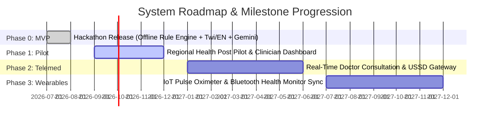

# Product Evolution & Future Roadmap

## 1. Phased Product Horizon

---

## 2. Detailed Milestone Features

### Phase 0: Production Hackathon MVP (Current Baseline)
- 100% Client-side offline clinical decision engine (MTS-inspired).
- Dual language UI and voice intake for **English** and **Twi**.
- Google Gemini API hybrid contextual enrichment stream (when online).
- Emergency panic button, GPS capture, pre-formatted SMS alert generator.
- IndexedDB outbox pattern for transactional data synchronization.

### Phase 1: Regional Health Post Pilot (Q3 - Q4 2026)
- **Clinician Triage Review Portal**: Web portal allowing rural health clinic nurses to view incoming synchronized triage logs before patients arrive.
- **Additional Languages**: Expansion to Hausa, Yoruba, Swahili, and French.
- **USSD Emergency Protocol**: USSD gateway fallback (`*920*HEALTH#`) for non-smartphone feature phones.

### Phase 2: Telemedicine Integration (Q1 - Q2 2027)
- **Direct Tele-Consultation**: Integrated WebRTC video/audio call connection with remote general practitioners.
- **E-Prescription & Pharmacy Directory**: Geo-location mapping of nearest stocked pharmacies with verified prescription transfer.

### Phase 3: IoT & Wearable Integration (Q3 - Q4 2027)
- **Bluetooth Low Energy (BLE) Sync**: Direct ingestion of vital signs (heart rate, blood oxygen $\text{SpO}_2$, temperature) from low-cost pulse oximeters and digital thermometers directly into the triage rule engine.
