# Non-Functional Requirements (NFR) Specification

## 1. Quality Attributes Summary

This document specifies the technical performance, reliability, security, usability, maintainability, and scalability constraints for the **Health Triage Assistant**.

---

## 2. Detailed Performance Requirements

```mermaid
gantt
    title Triage Evaluation Latency Target (Offline Mode)
    dateFormat  X
    axisFormat %s ms

    section User Action
    Tap Submit/Option        :active, 0, 5
    section Client Processing
    IndexedDB Fetch Profile  :crit, 5, 20
    Rule Engine Evaluation   :active, 20, 45
    DOM Render Triage Card   :50, 75
```

### 2.1 Latency Benchmarks
- **NFR-PERF-01 (Offline Triage Execution)**: The client-side decision tree engine MUST complete evaluation and display the Triage Severity Card in `< 100 milliseconds` from the final user input.
- **NFR-PERF-02 (Application Load Time)**: Cold startup time of the Progressive Web Application (PWA) from Service Worker cache MUST be `< 1.2 seconds` on standard mobile devices (3G benchmark device, mid-range CPU).
- **NFR-PERF-03 (Online Gemini API Streaming)**: When connected, the backend API MUST stream the first token of the Gemini AI contextual response within `< 1.5 seconds` of request receipt.
- **NFR-PERF-04 (Database Query Execution)**: PostgreSQL database query execution time for standard endpoints (e.g., fetching user history, loading rule manifests) MUST be `< 50 milliseconds` at the 99th percentile ($P_{99}$).

---

## 3. Reliability & Availability

- **NFR-REL-01 (Offline Guarantee)**: Core clinical triage features (Rule Engine, First-Aid Protocols, Emergency SMS dispatch payload generation) MUST maintain `100% availability` regardless of cellular or Wi-Fi network availability.
- **NFR-REL-02 (Backend Uptime)**: The FastAPI backend service and PostgreSQL database MUST achieve `99.9% uptime` excluding scheduled maintenance windows.
- **NFR-REL-03 (Data Integrity)**: Offline outbox sync MUST enforce idempotent payload processing, guaranteeing zero duplicate triage records saved in PostgreSQL upon network restoration.

---

## 4. Security & Compliance Requirements

- **NFR-SEC-01 (Data Encryption in Transit)**: All client-server communication MUST be encrypted using TLS 1.3. Plain HTTP connections MUST automatically redirect to HTTPS.
- **NFR-SEC-02 (Data Encryption at Rest)**: Sensitive user health profile data stored locally in IndexedDB MUST be encrypted using AES-GCM 256-bit encryption with a key stored securely in browser secret storage. Server-side PostgreSQL storage MUST utilize encrypted volume storage (AWS EBS AES-256 or equivalent).
- **NFR-SEC-03 (Authentication)**: Backend administrative and user account endpoints MUST enforce OAuth2 authentication with JWT (JSON Web Tokens) carrying HMAC-SHA256 signatures and a maximum 60-minute expiration window.
- **NFR-SEC-04 (Input Sanitization)**: All incoming text and voice transcript strings MUST pass through strict sanitization filters preventing Cross-Site Scripting (XSS), SQL Injection, and Prompt Injection attacks against the Gemini API.

---

## 5. Accessibility & Usability

- **NFR-ACC-01 (WCAG Compliance)**: The UI MUST conform to **Web Content Accessibility Guidelines (WCAG) 2.1 Level AA** standards.
- **NFR-ACC-02 (Visual Contrast)**: Touch targets (buttons, selection chips) MUST be at least `48x48 pixels`. Emergency controls MUST feature a high-contrast color scheme (minimum 7:1 contrast ratio against background).
- **NFR-ACC-03 (Voice Navigation)**: All critical triage workflows MUST be navigable entirely using spoken voice commands or screen reader audio prompts.

---

## 6. Scalability & Resource Constraints

- **NFR-SCL-01 (Client Bundle Footprint)**: The total PWA client application bundle size (HTML, CSS, JS, offline decision trees, first-aid SVG graphics) MUST NOT exceed `4.5 MB` uncompressed, ensuring fast caching on low-bandwidth networks.
- **NFR-SCL-02 (Backend Throughput)**: A single FastAPI container instance MUST handle at least `500 requests per second (RPS)` for standard API endpoints without degrading response latency past 200ms.
- **NFR-SCL-03 (Database Connection Efficiency)**: The backend system MUST employ async database connection pooling (`asyncpg` via SQLAlchemy 2.0) capped at 20 active connections per worker process to prevent connection starvation under spike traffic.
