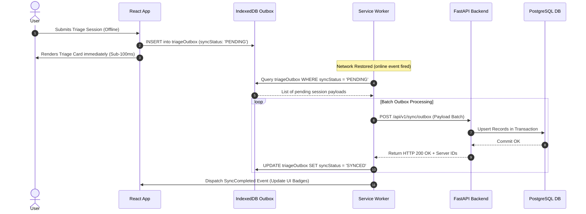

# Offline-First Architecture & Synchronization Strategy

## 1. Core Architectural Strategy

The **Health Triage Assistant** treats **offline capability as a primary architectural constraint**, not a progressive enhancement. The user must be able to launch the app, select a language, complete a full symptom triage, access emergency tools, and store their medical history without receiving a single network byte.

---

## 2. PWA Storage Topology

```
+-------------------------------------------------------------------------+
|                           BROWSER RUNTIME                               |
+-------------------------------------------------------------------------+
       |                                                    |
       v                                                    v
+-----------------------+                         +-----------------------+
|  SERVICE WORKER CACHE |                         |   INDEXEDDB (DEXIE)   |
+-----------------------+                         +-----------------------+
| - HTML App Shell      |                         | - Outbox Queue Table  |
| - JS/CSS Bundles      |                         | - Local User Profile  |
| - Decision Trees (JSON|                         | - Local Triage History|
| - First-Aid SVG/Cards |                         | - Rule Tree Cache     |
| - Audio Clips (MP3)   |                         | - Emergency Contacts  |
+-----------------------+                         +-----------------------+
```

---

## 3. The Outbox Pattern & Background Synchronization

When a user completes a triage session or updates their health profile while offline, the data is **never lost**. It follows the **Transactional Outbox Pattern**:



---

## 4. Conflict Resolution Protocol: Last-Write-Wins (LWW)

Because multiple devices may synchronize modifications to user profiles or emergency contacts, the system enforces a strict **Last-Write-Wins (LWW)** conflict resolution algorithm backed by UTC timestamps:

1. **Entity Versioning**: Every synchronized record contains a `updated_at` ISO-8601 UTC timestamp.
2. **Sync Ingestion Logic**:
   $$\text{If } T_{\text{incoming}} > T_{\text{existing}} \implies \text{Overwrite Record}$$
   $$\text{If } T_{\text{incoming}} \le T_{\text{existing}} \implies \text{Reject Incoming / Retain Server Version}$$

---

## 5. Network Bandwidth Adaptation & Connection Detection

The application uses an adaptive network listener (`useNetworkStore`):

| Connection Mode | Effective Type | Enabled Features | Caching Strategy |
| :--- | :--- | :--- | :--- |
| **Offline** | `none` | Client Rule Engine, Local Profile, Audio Chips, Emergency Panic. | 100% Service Worker + IndexedDB. |
| **Slow 2G / 3G** | `2g` / `3g` | Rule Engine, Outbox Sync, Compressed Text AI, No Audio Streaming. | Stale-While-Revalidate, text-only payloads. |
| **Fast 4G / Wi-Fi**| `4g` | Full Gemini SSE Streaming, Speech-to-Text, Neural TTS, Maps. | Network-First with Cache Fallback. |
