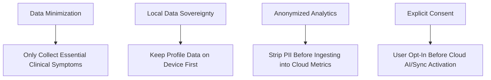

# Data Privacy & Governance Framework

## 1. Regulatory Compliance Alignment

The **Health Triage Assistant** is engineered in alignment with international data privacy frameworks, including the **Health Insurance Portability and Accountability Act (HIPAA)** guidelines, **General Data Protection Regulation (GDPR)** principles, and regional African data privacy acts (e.g., Ghana Data Protection Act 2012, ACT 843).

---

## 2. Privacy by Design Core Principles

---

## 3. Data Minimization & Retention Schedule

| Data Category | Stored Location | Retention Window | Deletion Protocol |
| :--- | :--- | :--- | :--- |
| **Local Health Profile** | Client IndexedDB | User-controlled (Until deleted/cleared) | One-tap "Purge Local Profile" in App. |
| **Local Triage History** | Client IndexedDB | 90 Days rolling window | Auto-purged after 90 days locally. |
| **Server Triage Logs** | PostgreSQL DB | 2 Years (Anonymized) | Hard delete via scheduled backend cron. |
| **AI Prompt Transcripts** | In-Memory / Ephemeral | Immediate (0 seconds storage) | Never written to disk; discarded post-stream. |

---

## 4. User Consent & Data Export Mechanics

1. **Explicit Cloud Sync Consent**: Users must explicitly accept the Data Privacy Notice during onboarding before background server synchronization is activated.
2. **Right to Data Portability (JSON/PDF Export)**: Users can tap "Export My Health Data" to generate an encrypted JSON file containing their entire profile, emergency contacts, and triage history.
3. **Right to Be Forgotten (Account Deletion)**: Tapping "Delete Account & Data" triggers a cascading database deletion (`DELETE FROM users WHERE id = :id`), purging all associated health records, emergency logs, and user credentials across server and client databases.

---

## 5. Third-Party AI Privacy Boundaries (Google Gemini)

To guarantee patient privacy during AI-enhanced voice consultations:
- **No PII Transmitted**: Patient names, phone numbers, and emergency contact details are **stripped** before sending prompts to the Google Gemini API.
- **Zero Training Retention**: The Gemini API enterprise configuration is set to **zero data retention for model training** (`store_prompts = False`).
