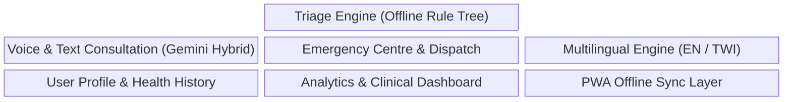

# Product Requirements Document (PRD)

## Product Identification

- **Product Name**: Health Triage Assistant
- **Version**: 1.0.0 (Hackathon Production Baseline)
- **Document Status**: Approved Architecture Specification
- **Product Type**: Progressive Web Application (PWA) with FastAPI Backend

---

## High-Level Product Objectives

1. **Accessibility**: Provide immediate, free, offline health triage advice to users anywhere, regardless of internet connectivity.
2. **Clinical Safety**: Ensure zero false-negative emergency classifications through validated decision trees.
3. **User Engagement**: Deliver empathetic, voice-assisted consultation flows in local languages (Twi and English).
4. **Data Sovereignty & Portability**: Maintain local storage of user health history with user-controlled cloud synchronization.

---

## Core Product Modules

### Module 1: Deterministic Triage Engine
- **Purpose**: Evaluates patient age, sex, primary complaint, red-flag symptoms, duration, and severity markers.
- **Output**: Formatted Triage Card containing Urgency Level (RED, ORANGE, YELLOW, GREEN), Primary Action, First-Aid Protocol, and Timeframe to Care.

### Module 2: Voice & Text Consultation Interface
- **Purpose**: Allows users to type or speak symptoms in natural language.
- **Online Mode**: Integrates Gemini AI to parse natural language, suggest relevant clinical symptoms to the rule engine, and generate conversational summaries.
- **Offline Mode**: Uses local keyphrase matching and interactive decision tree step-through.

### Module 3: Emergency Centre
- **Purpose**: Immediate response mechanism for RED urgency classifications or manual user activation.
- **Capabilities**: Direct dial to local emergency services (e.g., 112/999), automated SMS payload generation with GPS location, and offline first-aid cards (CPR, Choking, Hemorrhage).

### Module 4: Multilingual Translation Layer
- **Purpose**: Full UI and voice localization.
- **Languages**: English (`en-US`), Twi (`tw-GH`). Architectural structure allows adding Swahili, Hausa, and Yoruba via JSON locale manifests.

### Module 5: Health Profile & Offline History
- **Purpose**: Local-first storage of personal medical history (allergies, chronic conditions, blood type, emergency contacts) and past triage reports.

### Module 6: Analytics & Triage Insights Dashboard
- **Purpose**: Visualizes aggregate triage trends, symptom prevalence, emergency trigger rates, and system connectivity metrics (for healthcare admins).

---

## Operational Boundaries & Clinical Disclaimers

> [!WARNING]
> **Strict Operational Boundary**:
> The Health Triage Assistant is a **clinical triage and decision support tool**, **NOT a diagnostic system**. 
> All UI screens, voice outputs, and AI-generated consultation summaries MUST display or articulate the mandatory medical disclaimer:
> *"This tool provides preliminary health triage advice and is not a substitute for professional medical diagnosis or emergency treatment."*

---

## Success Key Performance Indicators (KPIs)

| Metric | Target Goal | Measurement Method |
| :--- | :--- | :--- |
| **Offline Triage Latency** | `< 100 ms` | Client-side performance trace from submit to decision tree render. |
| **Online Gemini Response Time** | `< 2.5 s` | Backend API timing metrics from Gemini prompt dispatch to stream end. |
| **Offline Availability** | `100%` | Service Worker cache hit ratio for core asset bundle and rule engine. |
| **Triage Safety (Zero Missed REDs)** | `100%` | Automated unit test validation against standard clinical benchmark test cases. |
| **Voice Recognition Accuracy** | `> 90%` | Speech-to-text string similarity against test audio files (English/Twi). |
