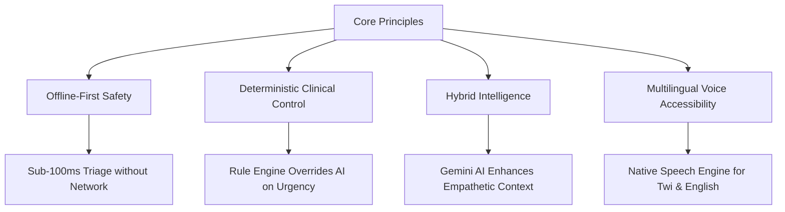

# Project Overview — Health Triage Assistant

## Executive Summary

The **Health Triage Assistant** is a hybrid, offline-first clinical decision support and triage application designed to bridge critical gaps in primary healthcare access, especially in resource-constrained environments, rural areas, and low-connectivity regions.

Combining **deterministic clinical rule-based triage** with **generative AI (Google Gemini)**, the platform empowers patients to assess acute symptoms, receive instant emergency guidance, communicate in local languages (starting with Twi and English), and store their clinical health history securely on their device.

---

## The Problem Statement

Access to timely, accurate healthcare advice is hindered by major barriers globally and acutely across Sub-Saharan Africa and developing regions:

1. **Severe Doctor-to-Patient Ratios**: Rural regions often face ratios exceeding 1 physician per 10,000+ residents, leading to overwhelmed emergency departments and delayed care.
2. **Intermittent Internet Connectivity**: Traditional cloud-dependent healthcare platforms fail in rural or disaster-affected zones where 3G/4G connectivity is unreliable or nonexistent.
3. **Language & Literacy Barriers**: Medical consultations are typically conducted in dominant administrative languages (e.g., English), creating comprehension barriers for native speakers of regional languages like Twi.
4. **Panic & Delayed Triage**: Individuals experiencing sudden acute symptoms (e.g., chest pain, severe fever, stroke signs) lack immediate, clear instructions on whether to seek emergency care or monitor at home.

---

## Core Philosophy & Design Values

### 1. Offline-First Safety
The system operates on the guarantee that **a life-critical symptom triage must never fail because of a dropped network packet**. All critical decision trees, emergency first-aid protocols, and user records reside in local storage (IndexedDB).

### 2. Deterministic Triage Primacy
Generative AI models can suffer from hallucinations or inconsistent output formatting. Therefore, clinical severity levels (**RED - Emergency**, **ORANGE - Very Urgent**, **YELLOW - Urgent**, **GREEN - Standard/Self-Care**) are determined exclusively by a validated, deterministic clinical rule engine.

### 3. Hybrid Intelligence (AI Enhancement)
When online connectivity is available, the system invokes **Google Gemini API** to digest the clinical rule output and provide natural, empathetic, and culturally contextualized explanations. Gemini translates complex medical jargon into clear conversational terms while maintaining the severity level prescribed by the rule engine.

### 4. Multilingual & Voice Accessibility
The application is designed from the ground up to support spoken and written multi-language interaction. In addition to English, the platform features native Twi translation matrices, acoustic voice input, and localized Text-to-Speech (TTS).

---

## Target User Personas

### Persona 1: Kwame (Rural Resident)
- **Age**: 38
- **Location**: Ejura, Ashanti Region, Ghana
- **Connectivity**: 2G / intermittent 3G
- **Primary Language**: Twi
- **Need**: Kwame experiences severe abdominal pain late at night. He needs instant, understandable guidance in Twi without waiting for a web page to load, telling him whether he needs immediate transport to a district hospital.

### Persona 2: Abena (Mother & Caregiver)
- **Age**: 29
- **Location**: Suburban Kumasi
- **Connectivity**: High speed 4G (home), spotty during commute
- **Primary Language**: English & Twi
- **Need**: Abena's toddler has a high fever. She wants to use voice input to describe symptoms quickly, get immediate first-aid guidance, and keep a digital record of the fever spikes.

### Persona 3: Dr. K. Mensah (Community Health Officer)
- **Age**: 45
- **Location**: Rural Health Post
- **Need**: Needs standardized, reliable triage data when patients are brought to the clinic, allowing quick review of the patient's offline triage history.

---

## Key Value Propositions

1. **Sub-100ms Offline Triage**: Immediate clinical risk categorization directly in the browser PWA.
2. **Zero Data Loss**: Offline outbox queues consultation logs and syncs seamlessly with PostgreSQL once connected.
3. **Emergency Quick-Action Hub**: One-tap trigger dispatching location coordinates and emergency contacts via direct calls or SMS fallback.
4. **Empathetic Voice Assistant**: Multilingual voice interface breaking literacy barriers for underserved populations.
