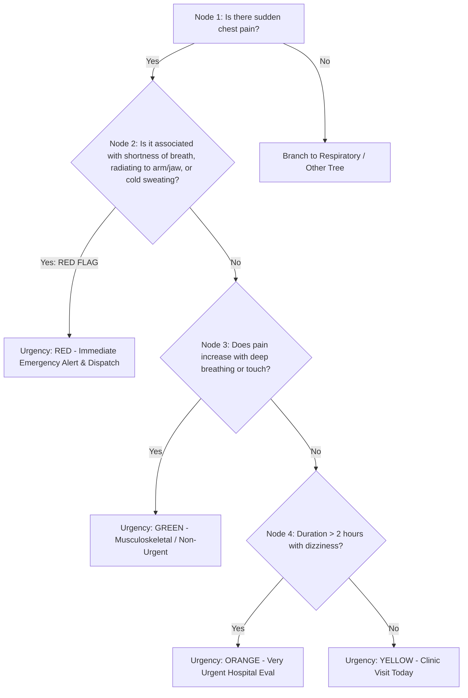

# Rule Engine Design & Clinical Decision Trees

## 1. Clinical Foundation: Adapted Manchester Triage System (MTS)

The triage rule engine is grounded in established international clinical risk stratification frameworks (specifically the **Manchester Triage System** and **Emergency Severity Index**), adapted for self-assessment and community health worker use.

### Severity Classifications

| Urgency Level | Badge Color | Target Clinical Timeframe | System Action Protocol |
| :--- | :--- | :--- | :--- |
| **RED** | Emergency (Red) | `Immediate (0 mins)` | Trigger Emergency Centre, request GPS, generate contact SMS, open direct emergency dialer. |
| **ORANGE** | Very Urgent (Orange) | `< 60 mins` | Direct user to nearest hospital / emergency department immediately. |
| **YELLOW** | Urgent (Yellow) | `< 24 hours` | Advise clinic visit within same day; provide specific monitoring & home first aid steps. |
| **GREEN** | Non-Urgent (Green) | `Self-Care / Routine` | Provide self-care guidance, symptom observation log, and routine appointment recommendation. |

---

## 2. Decision Tree JSON Schema Specification

Clinical decision trees are encoded in a standard JSON format that is parsed identically by both the TypeScript engine (client-side) and Python engine (backend).

```json
{
  "$schema": "http://json-schema.org/draft-07/schema#",
  "title": "TriageRuleTree",
  "type": "object",
  "properties": {
    "version": { "type": "string" },
    "symptomCategory": { "type": "string" },
    "initialNodeId": { "type": "string" },
    "nodes": {
      "type": "object",
      "additionalProperties": {
        "type": "object",
        "properties": {
          "id": { "type": "string" },
          "question": {
            "type": "object",
            "properties": {
              "en": { "type": "string" },
              "tw": { "type": "string" }
            },
            "required": ["en", "tw"]
          },
          "redFlagTrigger": { "type": "boolean" },
          "options": {
            "type": "array",
            "items": {
              "type": "object",
              "properties": {
                "label": {
                  "type": "object",
                  "properties": {
                    "en": { "type": "string" },
                    "tw": { "type": "string" }
                  }
                },
                "nextNodeId": { "type": "string" },
                "terminalResult": {
                  "type": "object",
                  "properties": {
                    "urgency": { "enum": ["RED", "ORANGE", "YELLOW", "GREEN"] },
                    "primaryAction": {
                      "type": "object",
                      "properties": {
                        "en": { "type": "string" },
                        "tw": { "type": "string" }
                      }
                    }
                  }
                }
              }
            }
          }
        }
      }
    }
  }
}
```

---

## 3. Decision Tree Logic & Flowchart (Chest Pain Example)



---

## 4. Evaluator Algorithm Specification

### Dual-Engine Mirroring Principle
The algorithm consists of a **pure state evaluation loop** with zero side-effects.

```typescript
// TypeScript Reference Evaluator Algorithm Signature
export interface EvalState {
  currentNodeId: string;
  userAnswers: Record<string, string>;
  isRedFlagTriggered: boolean;
}

export function evaluateNextStep(
  ruleTree: RuleTree,
  state: EvalState,
  selectedOptionIndex: number
): { nextState: EvalState; result?: TriageTerminalResult } {
  const currentNode = ruleTree.nodes[state.currentNodeId];
  const selectedOption = currentNode.options[selectedOptionIndex];

  // 1. Red Flag Override Check
  if (currentNode.redFlagTrigger || selectedOption.isRedFlag) {
    return {
      nextState: { ...state, isRedFlagTriggered: true },
      result: {
        urgency: 'RED',
        primaryAction: {
          en: 'SEEK IMMEDIATE EMERGENCY CARE. Call 112 / 999.',
          tw: 'BOA WO HO NTEMPA! Frɛ Gyaegyae/Asopiti ntɛm.'
        }
      }
    };
  }

  // 2. Terminal Node Check
  if (selectedOption.terminalResult) {
    return {
      nextState: state,
      result: selectedOption.terminalResult
    };
  }

  // 3. Traversal to Next Node
  return {
    nextState: {
      ...state,
      currentNodeId: selectedOption.nextNodeId!
    }
  };
}
```
