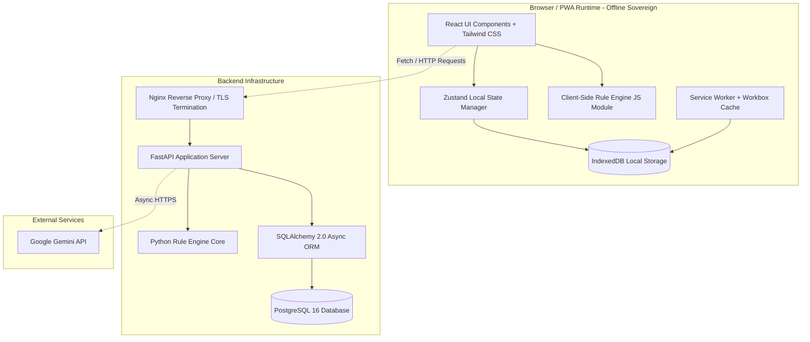
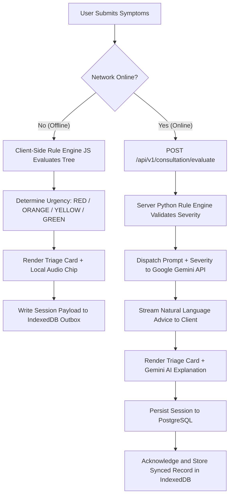

# System Architecture Specification

## 1. Executive Architecture Overview

The **Health Triage Assistant** is architected as an **Offline-First, Hybrid-Intelligence Progressive Web Application (PWA)** backed by a **FastAPI Micro-Framework Server** and a **PostgreSQL Relational Database**.

The system operates on a **Local-First / Server-Augmented Model**: all core triage logic, data persistence, translation dictionaries, and emergency tools exist client-side. The server provides synchronization, persistent multi-device storage, aggregate analytics, and online generative AI enhancement via Google Gemini.

---

## 2. C4 Model Architecture Diagrams

### 2.1 Level 1: System Context Diagram

```mermaid
graph TD
    User[Patient / Community Member] -->|Uses PWA (Voice / Text)| HealthApp[Health Triage Assistant PWA]
    EmergencyContact[Emergency Contacts] <--|Receives SMS Alerts| HealthApp
    HealthApp -->|HTTPS / REST API| Backend[FastAPI Backend Infrastructure]
    Backend -->|Database Queries| Postgres[(PostgreSQL Database)]
    Backend -->|API Requests| Gemini[Google Gemini AI Engine]
    Backend -->|STT Requests| Whisper[Whisper Speech Model API]
```

---

### 2.2 Level 2: Container Diagram



---

## 3. Offline vs. Online Data Flow Topology



---

## 4. Hybrid Intelligence Architecture Strategy

The cornerstone of the system's clinical safety is the **Strict Hybrid Separation Protocol**:

```
+-------------------------------------------------------------------------+
|                        INPUT: Symptom Transcript                        |
+-------------------------------------------------------------------------+
                                     |
                                     v
+-------------------------------------------------------------------------+
|                  STEP 1: Deterministic Rule Engine                      |
| Evaluates hard clinical criteria, age, red flags, duration.              |
| OUTPUT: Hard Severity Level (e.g., ORANGE - Very Urgent)                 |
+-------------------------------------------------------------------------+
                                     |
                                     v
+-------------------------------------------------------------------------+
|                  STEP 2: Generative AI (Gemini)                         |
| Prompts Gemini with:                                                    |
| 1. Patient symptoms                                                     |
| 2. MANDATORY SEVERITY = ORANGE (Forbidden to override or reduce)       |
| 3. Tone instructions: Empathetic, simple language, Twi/English context  |
| OUTPUT: Natural Language Guidance matching ORANGE severity               |
+-------------------------------------------------------------------------+
```

### Safety Guardrails:
1. **Severity Inviolability**: Gemini API prompt contains strict instructions enforcing the Rule Engine's output level.
2. **Fallback Safety**: If the Gemini API call times out ($>2.5\text{s}$) or throws an error, the system silently degrades to displaying the pre-rendered offline Rule Engine triage template.

---

## 5. Network Layer Boundaries & Protocols

| Link | Communication Protocol | Payload Format | Resilience Mechanism |
| :--- | :--- | :--- | :--- |
| **Client UI $\rightarrow$ Service Worker** | In-Memory Event Dispatch | JS Objects | Immediate Service Worker intercept |
| **Client $\rightarrow$ Backend API** | HTTPS / TLS 1.3 | JSON / Server-Sent Events | Outbox Queueing on HTTP 5xx / Network Fail |
| **Backend $\rightarrow$ PostgreSQL** | Async TCP (`asyncpg`) | Binary SQL Protocol | Connection Pooling & Auto-Reconnect |
| **Backend $\rightarrow$ Gemini API** | HTTPS / REST | JSON Payload | Exponential Backoff Circuit Breaker |
