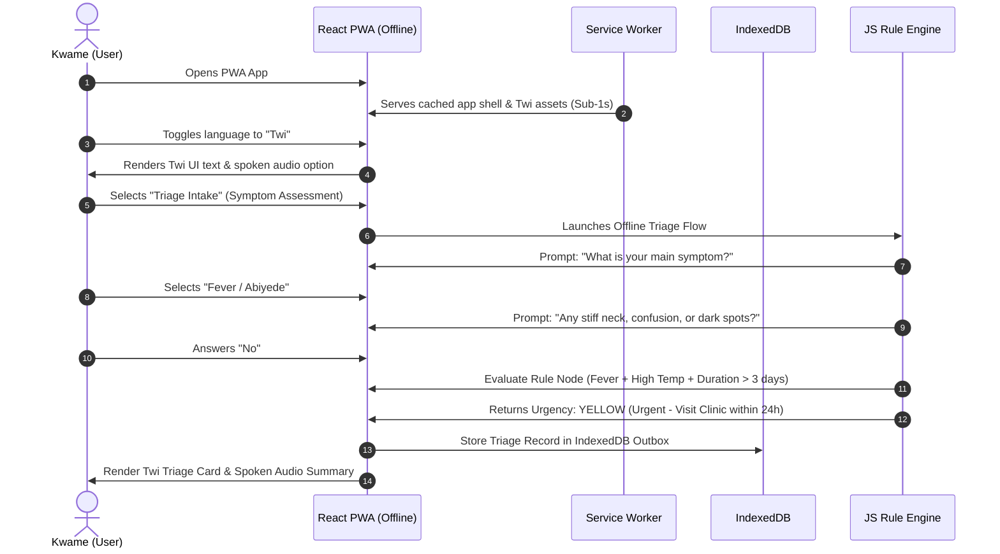
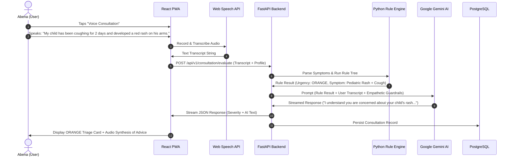
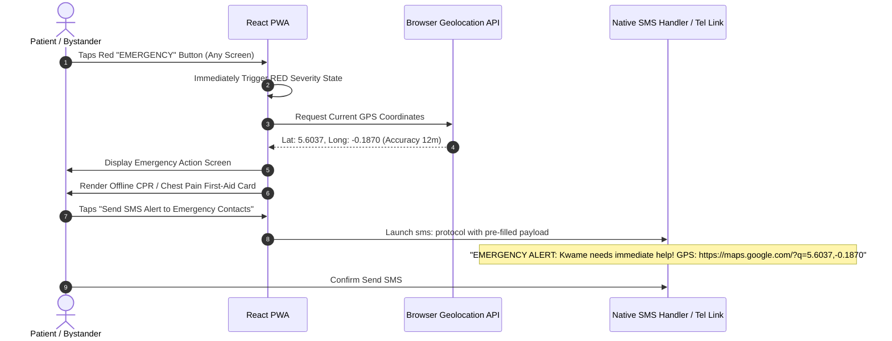
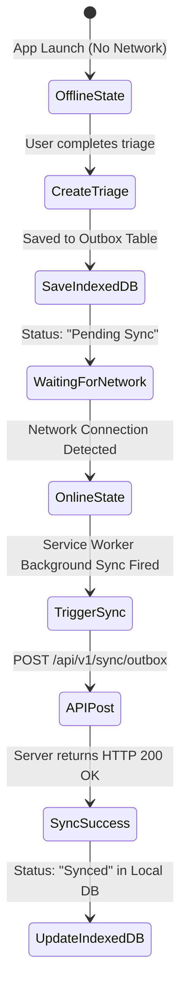

# User Journey Specifications

## 1. Overview

This document illustrates the primary user journeys and interaction flows within the **Health Triage Assistant**. It covers both offline and online scenarios, detailing how users navigate through acute symptom evaluation, voice input, emergency handling, and profile configuration.

---

## 2. Key User Journeys

### Journey 1: Offline Acute Symptom Triage (Kwame in Ejura)

**Context**: Kwame is in a rural area with no cellular internet. He develops severe fever and joint pains at midnight. He speaks Twi.

#### Step-by-Step Breakdown:
1. **Launch**: App opens instantly from Service Worker cache without network check.
2. **Language Selection**: Kwame taps "Twi". Interface re-renders immediately with localized labels.
3. **Intake Assessment**: Interactive step-through presents clear, single-question screens with large touch targets and optional audio playback.
4. **Offline Evaluation**: The JS Rule Engine evaluates responses in memory ($<10$ ms), identifying a moderate risk fever without red flags.
5. **Output**: Displays a **YELLOW (Urgent)** care card in Twi, instructing him to visit the local health post in the morning, listing hydration first-aid steps, and saving the report locally.

---

### Journey 2: Online Voice Consultation with Gemini AI Enhancement (Abena)

**Context**: Abena has an active 4G data connection. Her toddler has a cough and skin rash. She wants to speak her symptoms in English.

#### Step-by-Step Breakdown:
1. **Voice Input**: Abena presses and holds the mic button to speak naturally.
2. **Transcription**: Web Speech API converts audio to text transcript.
3. **Backend Rule Evaluation**: FastAPI passes extracted entities to the backend Rule Engine, which assigns **ORANGE (Very Urgent)** due to pediatric cough + rash guidelines.
4. **Gemini AI Augmentation**: Gemini AI generates a supportive, easy-to-understand explanation emphasizing urgent clinic evaluation while comforting the parent.
5. **Streaming Output**: The UI streams Gemini's response token-by-token and renders an ORANGE alert banner.

---

### Journey 3: Emergency Panic Activation & SMS Dispatch

**Context**: A user experiences sudden, crushing chest pain.

---

### Journey 4: Profile & Sync Status Journey

