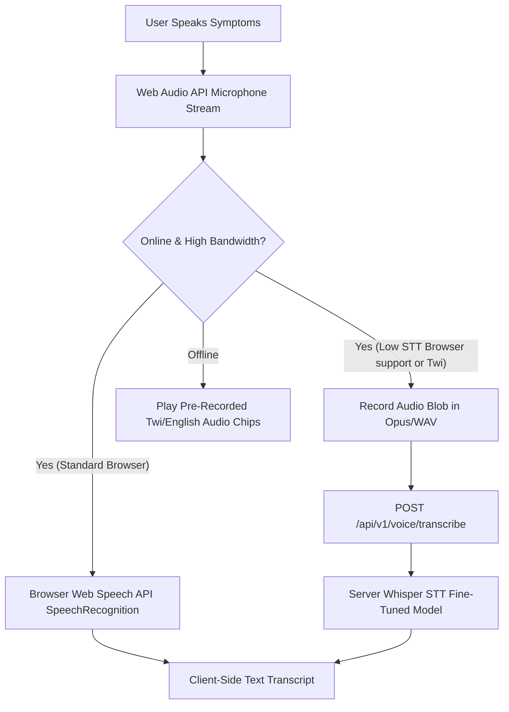

# Voice Consultation & Audio Pipeline Architecture

## 1. Overview & Dual Pipeline Strategy

The **Voice System** enables hands-free, accessible symptom intake and audio output for English (`en-US`) and Twi (`tw-GH`).

To operate reliably under varying network conditions, the architecture implements a **Dual Voice Pipeline**:



---

## 2. Text-to-Speech (TTS) & Audio Synthesis Pipeline

For audio output (listening to triage results):

1. **English Output (`en-US`)**: Uses browser native `window.speechSynthesis` with `SpeechSynthesisUtterance`.
2. **Twi Output (`tw-GH`)**:
   - **Offline Mode**: Plays concatenated pre-recorded MP3 audio chips stored in the PWA cache (e.g., `twi_red_alert.mp3`, `twi_fever_question.mp3`).
   - **Online Mode**: Streams high-fidelity neural Twi speech synthesis audio chunks from backend.

---

## 3. Audio Recording & Noise Pre-Processing

Audio recording uses the HTML5 `MediaRecorder` API configured with standard parameters:

```typescript
// Audio Recorder Configuration Parameters
export const AUDIO_RECORD_CONFIG = {
  mimeType: 'audio/webm;codecs=opus',
  audioBitsPerSecond: 32000, // 32 kbps optimized for voice over cellular
  sampleRate: 16000,         // 16 kHz optimal for speech recognition engines
  channelCount: 1,           // Mono channel
  noiseSuppression: true,
  echoCancellation: true,
  autoGainControl: true
};
```

---

## 4. Twi Language Acoustic Considerations

- **Tone and Vowel Qualities**: Twi (Akan) is a tonal language where pitch variation alters word meaning.
- **Transliteration Standard**: The system uses standardized Akan orthography (`Ɛ`, `Ɔ` characters handled cleanly in UTF-8 strings).
- **Phonetic Keyword Extraction**: When parsing Twi voice transcripts offline, the system matches phonetic stems (e.g., *tipae* $\rightarrow$ headache, *yefunu yareɛ* $\rightarrow$ abdominal pain, *hurae* $\rightarrow$ fever).
